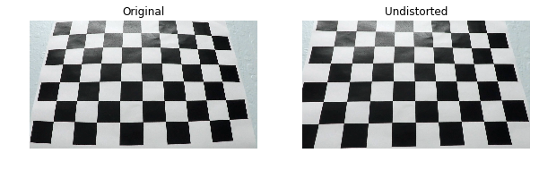
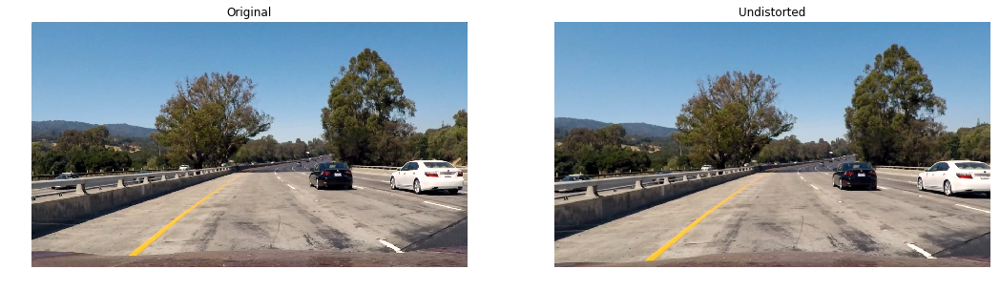
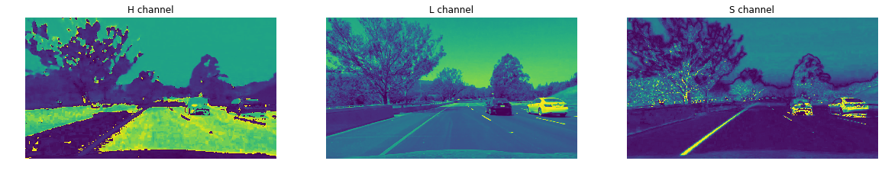
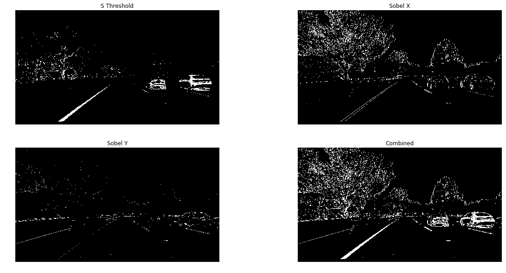
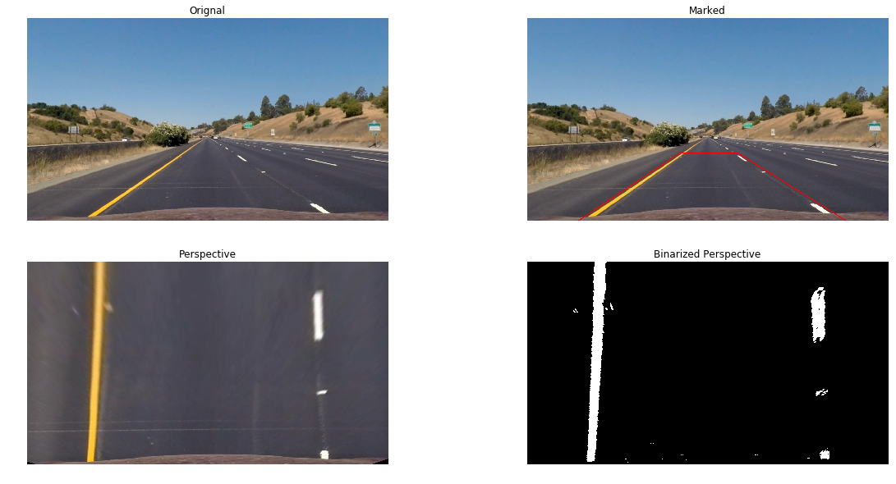
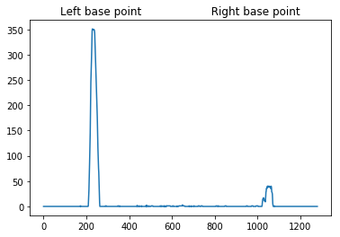
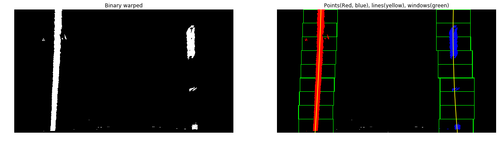
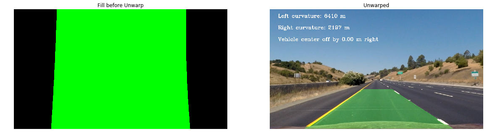
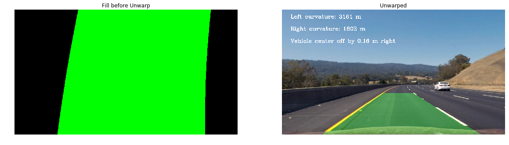

**Advanced Lane Finding Project**

The goals / steps of this project are the following:

1. Compute the camera calibration matrix and distortion coefficients given a set of chessboard images.
2. Apply a distortion correction to raw images.
3. Use color transforms and gradients to create a thresholded binary image.
4. Apply a perspective transform to rectify binary image ("birds-eye view").
5. Detect lane pixels and fit to find the lane boundary.
6. Determine the curvature of the lane and vehicle position with respect to center.
7. Warp the detected lane boundaries back onto the original image. Output the visual display of the lane boundaries and numerical estimation of lane curvature and vehicle position.

Refer to this [Jupyter Notebook](./Advanced_Lane_Lines.ipynb) for the code.

---
### 1. Camera Calibration

An image from an Uncalibrated camera experiences: <br>
**Radial distrotion:** Uneven curvature of the camera lense curves the ines in the image, more so as you move away from the center. <br>
**Tangential distortion:** When the camera is not aligned parallely to the image surface, objects seem farther away than they are.

We can remove both the distortions by calculating distortion coefficients **[k1, k2, p1, p2, k3]** and Camera matrix with the help OpenCV funtions.
1. Click about 20 images of a chessboard from various angles and distances.
2. Define two arrays **objectPoints** and **imagePoints**. objectPoints refer to the corner points on the chessboard in 3D real world cordinates. You can generate objectPoints using numpy's mgrid function. Z value in all objectPoints can be set to 0 because we know the object to be a flat chessboard. imagePoints refer to the 2D corner points on the images you clicked. OpenCV function `cv2.findChessboardCorners()` gives you the corners for imagePoints.
3. Using the objectPoints and imagePoints obtained from the previous step, we can obtain our coefficients from OpenCV funtion `cv2.CalibrateCamera()`.
4. Using the coefficients, you can now undistort you images with `cv2.undistort()` function.



#### 2. Example of a distortion-corrected image.
Having obtained correction coefficients, We can undistort any and every image take using this particular camera. Using `cv2.undistort()`, this test image was undistorted.


#### 3. Create a thresholded binary image with color transforms and gradients.

1. We can see that S channel picks the lane lines better. So we use only the S channel for the next step. <br> 
2. We threshold the S channel remove some finer noise.
3. We apply Sobel filter on gray undistorted image in both X and Y orientation and threshold thereafter.
4. We combine thresholded S channel, thresholded Sobel XY. This effectively removes some fine noise and detects the lanes better.


#### 4. Perspective transform.
Perspective transform gives a bird's eye view which helps us determine the actual curvature of the lane.
1. We pick four points of interest in the src array. We pick four points where we would like the points of interest to be mapped to. <br>
  ```python
  src = np.float32([[540, 480], [745, 480],
                  [1130, 720], [180, 720]])
  dst = np.float32([[200, 0], [img_size[0]-200, 0],
                  [img_size[0]-200, img_size[1]],[200, img_size[1]]])
  ```
2. OpenCV provides `cv2.getPerspectiveTransform(src,dst)` that returns `M` the tranformation matrix.
3. We use `cv2.warpPerspective(img, M, size, flags=cv2.INTER_LINEAR)` to get a warped image.
4. We may also unwarp the warped image. We get `M inverse` transformation matrix with the same function `cv2.getPerspectiveTransform(dst,src)` with src and dst arrays swaped in the parameters. As in previous step we may use `M inverse` to unwarp a warped image.


The lanes appear to be converging to a point in the distance on the orignal image. After transformation, you can see that the lanes are parallel.

#### 5. Identified lane-line pixels and fit their positions with a polynomial.
1. Take a histogram of the bottom half of the binary warped image. Pick two peaks of the histogram from the midpoint assign to right and left base. <br>
  
2. The image is divided into nwindows in y axis. In a loop of length nwindows, from the left and right base points, with a margin of 100px, append all the non zero pixels within the window to lists `lefty,leftx,righty,rightx`. Take mean of these pixels which will be your new base value and repeat.
3. Fit a second degree polynomial using these points with `np.polyfit(lefty,leftx)` and `np.polyfit(righty,rightx)` assigned to `left_fit` and `right_fit`.
4. We also map the polyfits into meters `left_fit_m` and `right_fit_m` by multiplying with coefficients `ym_per_pix` and `xm_per_pix` which are meters per pixel in x and y.


<br>
#### 6. Calculate the radius of curvature of the lane and the position of the vehicle with respect to center.
Once we have our polynomial fits, we can calculate the radius of the lane as follows:

`left_curve= ((1 + (2*left_fit_cr[0]*y_eval*ym_per_pix + left_fit_cr[1])**2)**1.5) / np.absolute(2*left_fit_cr[0])`

`right_curve = ((1 + (2*right_fit_cr[0]*y_eval*ym_per_pix + right_fit_cr[1])**2)**1.5) / np.absolute(2*right_fit_cr[0])`

where `right_fit` and `left_fit` is our polynomial fits gotten from our previous section. `y_eval` is the max y range and `ym_per_pix` helps us map the curvature to meters.

We can find the position of the vehicle w.r.t the center with the following steps:
1. We solve the polynomial equations at `y_max` and calculate the midpoints like so: <br>
`lineMiddle = lineLeft + (lineRight - lineLeft)/2`
2. The `vehicle_ceter` position would be `xMax/2`
3. We get the offset by `lineMiddle - vehicle_ceter`
4. If the offset is negative, it indicates that the vehicle is left of the center, otherwise right of the center.

#### 7. Warp the detected lane boundaries back onto the original image. Output the visual display of the lane boundaries and numerical estimation of lane curvature and vehicle position.

1. Once we detect the lane boundary, we can fill the areas between the left lane and the right lane with a green shade. <br>
`cv2.fillPoly(filled_binary, np.int_([pts]), (0,255, 0))`
2. We then unwarp the `filled_binary` image with `Minv` inverse transform matrix.
3. We can superimpose the unwarped `filled_binary` image onto the orignal image.
4. Information on left curvature, right curvature and offset from the center can be added with `cv2.putText()` function.




---

### Pipeline (video)

Here's a [link to my video result](./project_video.mp4)

---

### Discussion
1. Filtering out noise and capturing the lane lines could be improved with some more tweaking of thresholds, playing with kernel size, considering chanels other than S, superimposing various combinations of channels and filters etc. This step influence the results in the next steps making it a key step.
2. The code can be made efficient in space and avoid repeated code with OOP programming.
3. Additional data like rough lane width at a particular location from highway authorities, map's eztimation of lane width, GPS data  may be able to improve the accuracy on challenging lanes where lines are not clear.
