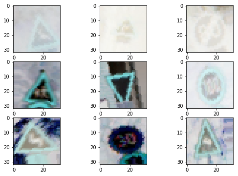

# **Traffic Sign Recognition**

## Writeup

**Build a Traffic Sign Recognition Project**

The sections covered in this writeup are as following:

1. Load and Explore our Dataset
2. Preprocess dataset for better results
3. Design, train and test a model architecture
4. Use the model to make predictions on new images
5. Analyze the softmax probabilities of the new images

[Solution Jupyter Notebook](./Traffic_Sign_Classifier.ipynb)

---

## 1. Load and Explore our Dataset

#### Loading the data
We use [German Traffic Sign dataset](https://d17h27t6h515a5.cloudfront.net/topher/2017/February/5898cd6f_traffic-signs-data/traffic-signs-data.zip) for training and validation.

We load the train and test data from the pickle file. The keyword 'features' is used to access Images and keyword 'label' is used to access labels.

#### Summary if the dataset
We use Numpy library to explore the statistics of our data.

* The size of training set is 34799.
* The size of the validation after we split from the training set will be 20% of 34799.
* The size of test set is 12630.
* The shape of a traffic sign image is 32x32x3
* The number of unique classes/labels in the data set is 43

Our model will train on 80% of 34799 images of 32x32x3 dimensions to be able to classify 43 traffic signs from our test dataset as well as test samples from the web at later stage. We will use 20% of our training dataset as validation set to tweak our model for performance gain.

#### Visual exploration of the dataset
Here are some random images from our dataset. It is evident that for some images the resolution is very low for humans to properly identify traffic signs.

The below distribution histogram shows that the number of samples for each class is varied. There are very few samples for about 60% of the examples. There will be need for Data Augmentation to amplify our sample space.

## 2. Preprocess dataset for better results

There are many preprocessing techniques we can choose from. This [article](goo.gl/23S5wn) summarizes the most used preprocessing techniques.

- We will choose not to Greyscale the images because we are not sure if different color backgrounds like yellow, blue or white has different meanings and that it may help network discern traffic signs better.
- We will use Normalization as opposed to Standardization

    

  Normalization is one of the feature scaling methods. Normalised data improves convergence during Gradient descent. Although image features are always in the range of [0-255] without any scope for outliers, it is observed that normalizing an image considerably improves performance.
- Data Augmentation helps us increase our training sample size with additional distorted images. Collecting training data is time consuming and a costly affair. Data Augmentation has proven to be a easier alternative to an extent. We will use Keras's [ImageDataGenerator](https://keras.io/preprocessing/image/) for data Augmentation. This library provides option to distort image in several ways.

#### Visualise Image after Normalization/Standardization

Let's visualise Orignal, Normalized and Standardized versions of a random image

 

#### Keras ImageDataGenerator
These are the abberations we will use for our data augmentation

- Rotations between 0 to 20 degrees in both left and right direction
- Shift width by range of 10%
- Shift height by range of 10%
- Zoom image by range of 20%

ImageDataGenration performs data augmenation at runtime so it doesn't have to store augmented images. This helps conserve disk space.

Notice the distortions generated using ImageDataGenerator on sample images from our dataset.

 

#### Split into Train and Validation set

- We shuffle the data so that each batch will have a mix of images from all the classes. This keeps the loss curve smoother.
- We split 20% of the training data for validation set. We will use the Validation set to tune our model later.

#### Resources on Data Preprocesing:
- [Data Augmentation](https://www.coursera.org/learn/convolutional-neural-networks/lecture/AYzbX/data-augmentation) and [Normalization](https://www.coursera.org/learn/deep-neural-network/lecture/lXv6U/normalizing-inputs) from Prof Andrew Ng's course on Deep Learning. The course is remarkable.
- Blog on Keras [ImageDataGenrator](https://towardsdatascience.com/image-augmentation-for-deep-learning-using-keras-and-histogram-equalization-9329f6ae5085)

## 3. Design, train and test a model architecture

#### Design Model Architecture

| Layer         		|     Description	        					|
|:---------------------:|:---------------------------------------------:|
| Input         	 	| 32x32x3 RGB image   							|
| CONV1             | Dimensions: Input 32x32x3, Output 28x28x16,   Filters: 16 of 5x5 filters, VALID padding,  Activation: ReLu|
| POOL1					    |	Dimensions: Input 28x28x16, Output 14x14x16  Kernel size: 2x2, Stride: 2x2, VALID Padding |
| CONV2             | Dimensions: Input 14x14x16, Output 10x10x64,   Filters: 64 of 5x5 filters, VALID padding,  Activation: ReLu|
| POOL2					    |			Dimensions: Input 10x10x64, Output 5x5x64  Kernel size: 2x2, Stride: 2x2, VALID Padding |
| FC0               |Dimensions: Input: 5x5x64, Output 1600 |
| FC1               |Dimensions: Input: 1600, Output 240   Dropout: Keep probablity: 0.6   Activation: ReLu |
| FC2               |Dimensions: Input: Keep probablity of 240, Output 84   Dropout: Keep probablity: 0.6   Activation:ReLu |
|FC3                |Dimensions: Input: 0.6 of 84, Output 43 |

#### Train the Model
Parameters used for Training
- Validation size: 0.2
- Dropout = 0.6
- Epochs = 30
- Batch size = 32
- Learning rate = 0.001
- Optimizer = Adam

A validation set can be used to assess how well the model is performing.
- A low accuracy on the training and validation sets imply underfitting.
- A high accuracy on the training set but low accuracy on the validation set implies overfitting.

Dropout is a regularization technique used to prevent model from overfitting.

Learning rate is usually small. We can tweak it if the loss curve seems erratic on one hand or training becomes too slow on another.

We have several choices of Optimizers like SGD, Momentum, RMS prop etc. but Adam combines the benefits from all the listed optimization technique.

#### Results

| Dataset type         	|     Accuracy	        					|
|:---------------------:|:-------------------------------:|
|Training set           |0.991                            |
|Validation set         |0.987                            |
|Test set               |0.944                            |

The gap between Validation accuracy and Test set accuracy is larger in comparision. This suggests that our future course of action should start with reducing overfitting with Regularization techniques, perhaps increase Dropout. But we should realise that once we reduce overfitting, we will have to deal with Avoidable bias in the next step. This process goes on until we find a set of parameters that gives us the best possible resuts for the limitations we have in terms of size of dataset, image quality, computational power etc.

It looks like at Epoch 30 the Accuracy curve has reached a platue at which time the training can be stopped.

## 4. Use the model to make predictions on new images

We download 12 Traffic signs from Web belonging to two categories
- Classes that have training sample size of above 1000.
- Classes that have training sample size of less than 1000.

#### Performace on classes trained on larger samples

We see that 4 of 6 predictions are right bringing the performace figure to 66.66%.
Sometimes, when the model is trained again, We see that 5 of 6 predictions are right bringing the performace figure to 83.33%.
- The Traffic sign that it gets wrong is 'Speed limit 60km/h' and 'Speed limit 50km/h' which looks like 80km/hr. The culprit seems to be image resolution since both of these images are Speed limit images.
- However, if we consider human accuracy as a baseline, we see that our model suffers from high bias.

#### Performace on classes trained on larger samples

We see that 4 of 6 predictions are right bringing the performace figure to 66.66%.
Sometimes, when the model is trained again, We see that 5 of 6 predictions are right bringing the performace figure to 83.33%. It's funny that it happens when I run on AWS but not on my local computer.
- The Traffic sign that it gets wrong is 'Slippery road'. Low resolution seems to be the begger problem.
- The other sign it gets wrong is 'Roundabout'. It confuses it for 'Keep Right' which is a subset of 'Roundabout' if you look at the image carefully. In this case it looks like having less training example and low resolution is the culprit.

It is surprising that despite being trained on comparitively smaller training example size, the performace is equal to the one's with larger training sample size. If human error is to be considered as a Bayes error rate, then it looks like our model suffers from huge bias. Things we can do:
- Better images and higher resolution.
- A bigger network.
- Training longer.

The other problem is that our test images come from a different distribution than the ones from German Traffic sign dataset. The test images from the web may have different characteristics like light, aangle, zoom, image centre offset etc. that contribute to deteriorated performace.

Watch Prof. Andrew Ng's lesson on [Bias and Variance with mismatched data distribution](https://www.coursera.org/learn/machine-learning-projects/lecture/ht85t/bias-and-variance-with-mismatched-data-distributions)

## 5. Analyze the softmax probabilities of the new images

|  Image | Probability  |     Prediction	         |
|:------:|:------------:|:------------------------:|
|Go straight or left       |  0.00122    0.74575   0.24819   0.0   0.00305 | Ahead only   **Go straight or left**   Turn left ahead   Go straight or right  Keep right|
| Dangerous curve to the right      |  0.01173   0.98826   0.0   0.0   0.0 | Dangerous curve to the right   **Traffic signals**  Road work   Children crossing  General caution|
| Roundabout mandatory      |  0.02439   0.92278   0.0   0.0   0.00038 | Keep right   **Roundabout mandatory**  Speed limit (70km/h)   Wild animals crossing  Go straight or right|
|End of all speed and passing limits      |  0.92966   0.07033  0.0   0.0   0.0 | **End of all speed and passing limits**   End of no passing  Traffic signals (70km/h)   End of speed limit (80km/h)  No passing|
| Slippery road       |  0.0   0.0 0.90572  0.0523   0.0 | Slippery road   Wild animals crossing  **Bicycles crossing**   Dangerous curve to the right  Double curve|
| Bumpy road       |  0.1   0.0   0.0   0.0   0.0 | **Bumpy road**   Slippery road  Bicycles crossing   No vehicles  Dangerous curve to the left|

1. Gets 'Go straight or left' correct. The second probablity is 'Turn left ahead' which makes sense because the Traffic sign in question actually shows arrows in both left and ahead direction.
2. Gets 'Dangerous curve to the right' wrong. The correct label has a probablity of about 1% whereas the wrong prediction of 'Traffic signals' has a probablity of 98%.
3. Gets 'Roundabout mandatory' correct with 92% confidence.
4. Gets 'End of all speed and passing limits' correct. The second guess with 7% confidence is 'End of No passing' which makes sense because both of these signs have a noticable grey colored diognal marks.
5. Gets 'Slippery road' wrong. Guesses it to be 'Bycycle crossing' with 90% confidence and 0% confidence on the correct label. The image relsolution is poor for even humans to discern.
6. Gets 'Bumpy road' with a perfect 100%.
