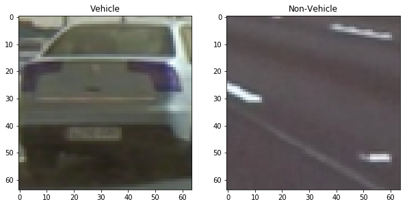
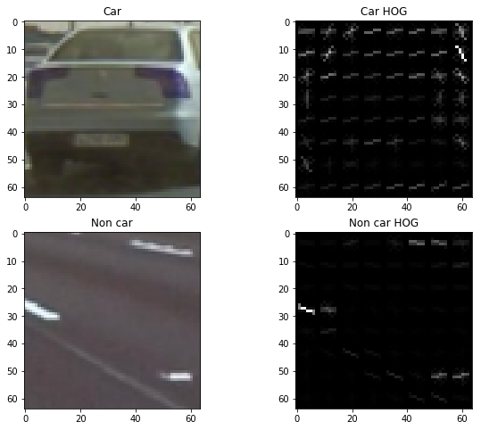
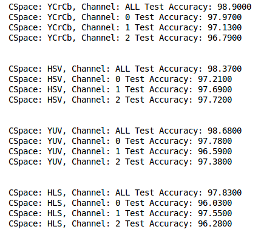
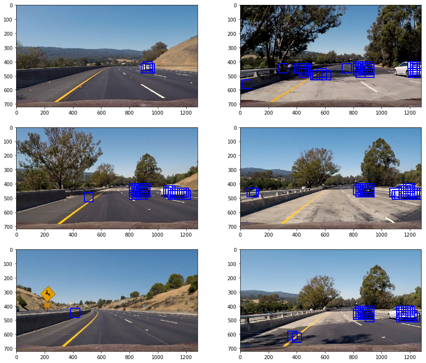
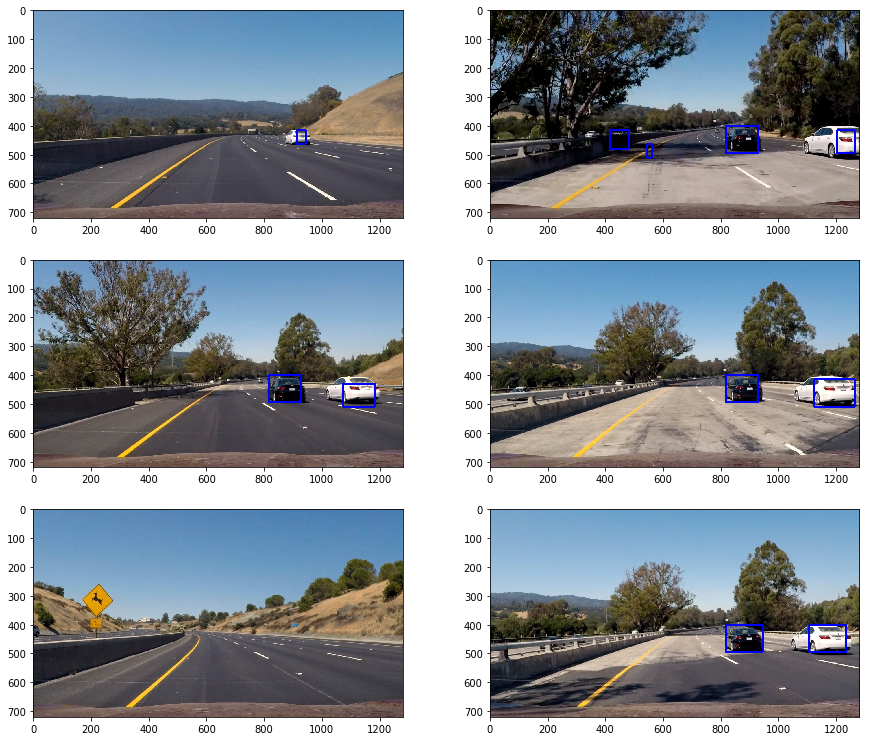
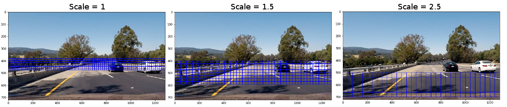
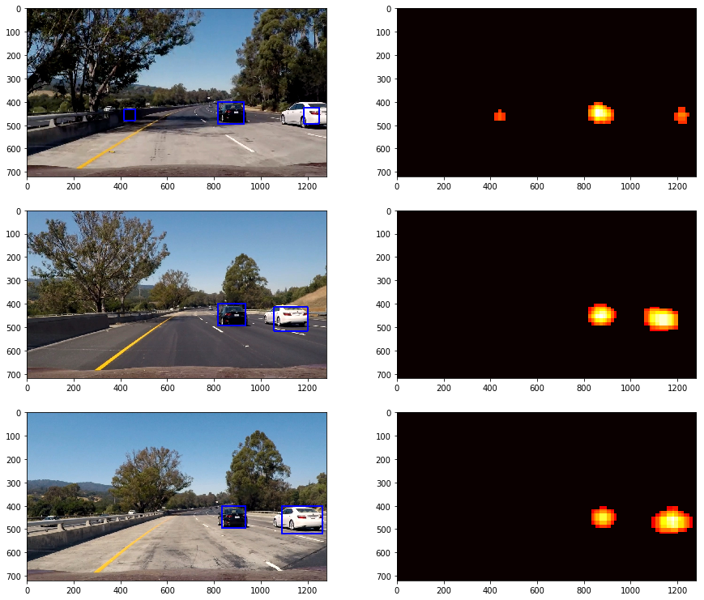

---
# Vehicle Detection Project

The goals / steps of this project are the following:

1. Perform a Histogram of Oriented Gradients (HOG) feature extraction on a labelled training set of images, apply a color transform and append binned color features, as well as histograms of color, to your HOG feature vector. Train a classifier Linear SVM classifier.
2. Normalise your features and randomise a selection for training and testing.
3. Implement a sliding-window technique and use your trained classifier to search for vehicles in images.
4. Run your pipeline on a video stream and create a heat map of recurring detections frame by frame to reject outliers and follow detected vehicles.
5. Estimate a bounding box for vehicles detected.

Refer to this [Jupyter Notebook](./Vehicle_Detection.ipynb) for code.

---

### 1. Histogram of Oriented Gradients (HOG)

#### 1. HOG feature extraction, Color transformation, Binned color features

We start by loading images from our training dataset of `vehicle` and `non-vehicles`. 

**Plot a sample from each of these categories.**

We assume some parameters to be reasonable and experiment others. We will use `skimage.feature.hog` function to extract HOG features from our images. Let's use these parameters `orientations=9`, `pixels_per_cell=8` and `cells_per_block=2` for now to get a glimpse of how HOG features look like. 

** Plot sample images from vehicle and non-vehicle category as their respective HOG**
 

#### 2. My Experiments with HOG parameters.

Let's experiment with Color spaces `'YCrCb','HSV','YUV','HLS'` and Channels `'ALL',0,1,2` to find the combination that gives us maximum accuracy on our classifier. 

We will use Binned color features with spatial size of `(16, 16)` in our experiments. We will use 32 `nbins` for color histogram features. 

**Steps to build our SVC Classifier**
1. We concatenate `spatial_features`,`hist_features` and `hog_features` for each image in our dataset that consist of `vehicle` and `non-vehicle` images.
2. We stack features from `vehicle` and `non-vehicle` with `np.vstack()` to form our X samples.
3. We stack `np.ones(len(vehicle_features))` and `np.zeros(len(non_vehicle_features)` to form our `y` labels.
4. We use `sklearn.preprocessing.StandardScalar()` to standardize our features (zero mean and scaling to unit variance)
5. We then shuffle and split our features and labels into `X_train, X_test, y_train, y_test` using `sklearn.model_selection.train_test_split()`.
6. It's time to create our SVC model using `sklearn.svm.LinearSVC()` and fit it on our training set.
7. We obtain accuracy with `svc.score()` function. 
8. For each of our parameter combinations in Color spaces and Channels we list their respective accuracies for systematic comparison.

** Print Accuracies for different combinations of Color spaces and Channels **

Looking at the accuracies it is clear that color space of `YCrCb` and `ALL` channels gives us the best accuracy of `98.90`.
 
** Most optimal set of parameters from our experiment **

|Parameter		|Value		      |
|:-----------------------|-----------------------:|
|Color Space		|YCrCb			|
|Channels	|All					|
|Orient		|9				|
| Pixels per cell|8				|
| Cell per block|2				|
|Spatial size| (16,16)		|
|nbins		|32					|

Refer to this [Jupyter notebook](./Hog_Experiments.ipynb) to get a glimpse of the above steps.

### 3. Sliding Window Search

#### 1. Window sliding, HOG sub-sampling, Scale and window

We will modify `find_cars()` function provided in this [course lesson](https://classroom.udacity.com/nanodegrees/nd013/parts/fbf77062-5703-404e-b60c-95b78b2f3f9e/modules/2b62a1c3-e151-4a0e-b6b6-e424fa46ceab/lessons/05b03f20-8c4b-453c-b41e-9fac590278c7/concepts/c3e815c7-1794-4854-8842-5d7b96276642). The `find_cars()` function uses HOG sub-sampling method to reduce processing duration. It does this by extracting HOG features for an Image first and then sampling based on window size and scale. It performs prediction using svc classifier on each of these window samples and returns those windows that are positive for a car. 

With parameters `cells_per_step = 2`, `scale = 1`, `window = 64`, `pix_per_cell = 8`, `y_start = 400` and `y_stop = 656`we get results that like so:

** Observations: **

1. We can see a lot of False Positives. 
2. Using `scale = 1` identifies cars at a  distance better than `scale = 1.5`. 

#### 2. Improvements

Lets deal with the False Positives with heatmaps. We get helper functions for this in this [course lesson](https://classroom.udacity.com/nanodegrees/nd013/parts/fbf77062-5703-404e-b60c-95b78b2f3f9e/modules/2b62a1c3-e151-4a0e-b6b6-e424fa46ceab/lessons/05b03f20-8c4b-453c-b41e-9fac590278c7/concepts/de41bff0-ad52-493f-8ef4-5506a279b812). The function `add_heat()` adds heat to a map for all the bounding boxes. We can reject false positives by thresholding the map. We use `scipy.ndimage.measurements.label` to count the number of cars and location. 

** After applying heatmap**

It is evident that most of the False positives are removed but there are a few. After some examining it was found that
 
1. We had previously used 24 `nbins` instead of 32 `nbins`. We will rectify this. 
2. This [page](https://sites.coecis.cornell.edu/chaowang/2017/03/10/self-driving-car-vehicle-detection-and-tracking/) explores the idea of having multiple `scale` based on location on the image. It makes sense to have a smaller scale for distant cars and higher scale for cars closer to the camera. So we will use three `ystart`, `ystop` and `scale`set and process boxes found for each set and append to our `windows` list. We will use heatmap on the `windows`, threshold it and use `labels` to find the cars.
	`ystarts_ystops = [(380, 480, 1), (400, 600, 1.5), (500, 700, 2.5)]`

** Sampling region with multiple scales **

 
** Results after applying multiple scales **
 

As seen in the images, there is an improvement but there is still one False positive. At this point, We could go ahead an create a Video pipeline and leave room for improvement thereafter.

---

### Video Implementation

Here's a [link to my video result](./output_video.mp4)

#### Combining bounding boxes from multiple frames and filtering for false positives.

** Steps in our video pipeline **

1. Video pipeline function `pipeline()` extracts frames one by one from the project video and calls `DetectVehicle()` to process the frame.
2. We have a `Windows` object to store bounding boxes from last 15 frames. As and when bounding boxes for a frame arrives, window object stores it. It also cleans up older ones so as ensure only the bounding boxes from the latest 15 frames are retained.
3. We have three set of scaling parameters and their respective `y_start` and `y_stop` coordinates. For each of these set of parameters, bounding boxes are obtained by our function `find_cars`.
4. The bounding boxes for the frame are pushed into our `windows` object. 
5. We add heat for each of these bounding boxes with function `add_heat()`.
6. We apply threshold equal to `len(windows.peek_rects())*2` through function `apply_threshold`. The threshold was discovered to be working well for me. A threshold of 2 worked well for a single test image. It makes sense that `len(windows.peek_rects())*2` works well for 15 frames. Applying threshold on multiple frames and multiple scales for each of these frames drastically cuts down on false positives.
7. `label` from `scipy.ndimage.measurements` helps us identify blobs (cars) in the heatmap. We draw bounding boxes on the frame around these blobs from the `label` function.
8. The frame is returned to the calling function `pipeline`. The frame is promptly written to our outfile.

---

### Discussion

1. The challenging part of the project was dealing with False Positives. I had to play around with parameters quiet a lot. 
2. The current implementation uses HOG subsampling with multiple scales. This requires a lot of processing and is not suitable for real-time vehicle tracking without high end graphics cards(I assume). This is a great limitation.
3. The frames are a bit gittery and there are very few false positives. We cannot tolerate having false positives, especially closer to the car. This is a more critical limitation.
4. The dataset we trained our classifier is too small in size, too narrow in diversity and too close in lighting conditions. We need a better dataset to be able to generalise to different vehicles and tracks.
5. Our pipeline detects oncoming cars as well. I am not sure how the vehicle is supposed to understand that there is a barricade separation between it's lane and the opposite lane.
6. We may be able to get a more robust results using YOLO object detection algorithm.

The project was interesting. It helped understand concepts in traditional Computer Vision. It helped me imagine how it could potentially compliment deep learning algorithms. I appriciate Udacity team for bringing together this amazing project and all the resource required to sail through it.
